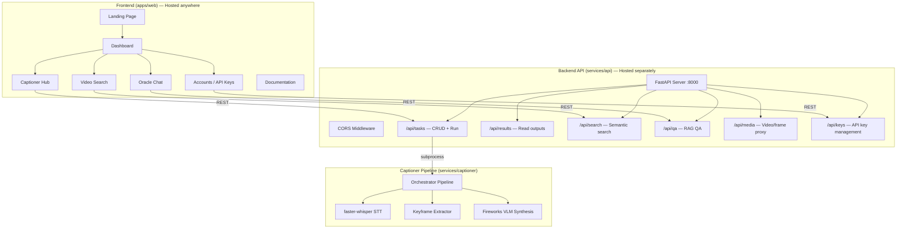
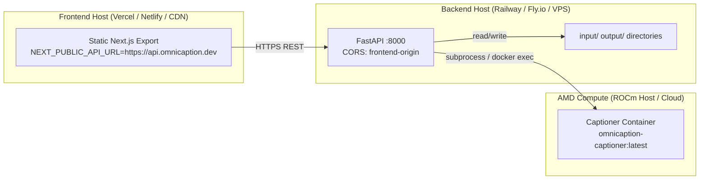

# Implementation Plan — OmniCaption Video-Oracle Frontend

## Goal Description

Build a **premium, animation-rich web application** for OmniCaption that showcases the Track 2 captioning pipeline and Track 3 Video-Oracle search/QA features. The frontend and backend are **fully decoupled** — the frontend is a static Next.js export that can be hosted on Vercel/Netlify/any CDN, while the backend is a standalone FastAPI service deployable anywhere (Railway, Fly.io, a VPS, etc.).

### Key Design Decisions
- **VengeanceUI + shadcn/ui** — VengeanceUI provides animation-first components (hero sections, animated buttons, bento grids, glow borders) layered on top of shadcn/ui primitives (dialogs, inputs, tabs, etc.)
- **Decoupled architecture** — Frontend communicates with the backend exclusively via REST API. The API base URL is configurable via environment variable (`NEXT_PUBLIC_API_URL`)
- **User-managed API keys** — Users can add their own Fireworks AI API key from the Accounts page, stored in the backend per-session or persisted in local storage for the frontend-only demo mode

---

## Architecture Overview



---

## User Review Required

> [!IMPORTANT]
> **Decoupled Deployment Model**: The frontend builds to a static export (`next build && next export` or `output: 'export'`). 
> The API URL is injected at build-time via `NEXT_PUBLIC_API_URL`. This means:
> - You can host the frontend on Vercel/Netlify and the backend on Railway/Fly.io
> - Or run both locally for development
> - The backend must have CORS configured to allow the frontend origin

> [!IMPORTANT]
> **VengeanceUI Installation**: Components are added via the shadcn CLI pointed at the VengeanceUI registry:
> ```bash
> npx shadcn@latest add https://www.vengenceui.com/r/<component-name>.json
> ```
> This copies the component source into your project (fully customizable, no external dependency).

> [!WARNING]
> **Ollama Local Layer**: Step 2 (code generation via local Ollama qwen3:14b) will begin **after** Tumo completes his end of the handover. This plan covers Step 1 (Cloud Layer blueprint) only.

---

## Open Questions

> [!IMPORTANT]
> **Next.js vs Vite**: VengeanceUI docs primarily target Next.js. We recommend **Next.js 15 (App Router)** for SSG/SSR flexibility and easy static export. Are you aligned, or do you prefer Vite?

> [!IMPORTANT]
> **API Key Storage**: Should user API keys (Fireworks) be:
> - **(a) Browser-only** — stored in `localStorage`, sent as a header with each request (zero backend persistence)
> - **(b) Backend-persisted** — stored in a lightweight SQLite DB on the backend, keyed by a session token
> - **(c) Both** — localStorage for the demo, backend-persisted for production
>
> We recommend **(a)** for hackathon simplicity — the frontend stores the key and passes it as `X-Fireworks-Key` header.

---

## Proposed Changes

### 1. Frontend Application (`apps/web/`)

#### [NEW] apps/web/ — Next.js 15 App

Initialize with:
```bash
cd apps/web
npx -y create-next-app@latest ./ --typescript --tailwind --eslint --app --src-dir --import-alias "@/*" --use-npm
```

#### [NEW] apps/web/components.json — shadcn + VengeanceUI registry
```json
{
  "$schema": "https://ui.shadcn.com/schema.json",
  "style": "new-york",
  "rsc": true,
  "tsx": true,
  "tailwind": {
    "config": "tailwind.config.ts",
    "css": "src/app/globals.css",
    "baseColor": "zinc",
    "cssVariables": true
  },
  "aliases": {
    "components": "@/components",
    "utils": "@/lib/utils"
  },
  "registries": {
    "vengeance": {
      "url": "https://www.vengenceui.com/r/{name}.json"
    }
  }
}
```

#### Theme & Design System (Dark-first, AMD Red accent)
```css
/* globals.css — key tokens */
:root {
  --background: 0 0% 100%;
  --foreground: 240 10% 3.9%;
  --primary: 0 72% 51%;        /* AMD Red */
  --primary-foreground: 0 0% 98%;
  --accent: 240 4.8% 95.9%;
}
.dark {
  --background: 240 10% 3.9%;  /* Near-black */
  --foreground: 0 0% 98%;
  --primary: 0 72% 51%;        /* AMD Red */
  --card: 240 10% 6%;
  --muted: 240 3.7% 15.9%;
}
```

---

### 2. Page Structure & VengeanceUI Component Mapping

| Page | Route | Purpose | VengeanceUI Components |
|------|-------|---------|----------------------|
| **Landing** | `/` | Marketing hero, features, CTA | `aurora-hero`, `flip-text`, `animated-rays`, `stacked-logos`, `testimonials-card`, `faq-accordion` |
| **Dashboard** | `/dashboard` | Overview cards, recent runs, quick actions | `expandable-bento-grid`, `animated-number`, `glow-border-card` |
| **Captioner Hub** | `/dashboard/captioner` | Submit videos, view styled captions, video player | `cursor-card`, `elastic-stack` (caption styles) |
| **Video Search** | `/dashboard/search` | Semantic moment search with keyframe results | `gooey-search`, `image-reveal-list`, `perspective-grid` |
| **Oracle Chat** | `/dashboard/oracle` | RAG QA conversational interface | `kinetic-text-loader`, `animated-tooltip` |
| **Accounts** | `/dashboard/accounts` | API key management, user preferences | `corner-button`, `generate-button` |
| **Docs** | `/docs` | API reference, usage guides | `interactive-book`, `scroll-dissolve-reveal` |

---

### 3. Detailed Page Designs

#### Landing Page (`/`)

```
┌─────────────────────────────────────────────────────┐
│  [Spotlight Navbar]  OmniCaption  │ Features │ Docs │ Dashboard → │
├─────────────────────────────────────────────────────┤
│                                                       │
│  [Aurora Hero Background]                             │
│     ╔═══════════════════════════════════╗              │
│     ║  AI-Powered Video Captioning      ║  [flip-text] │
│     ║  Powered by AMD ROCm              ║              │
│     ║  [Get Started →] [View Docs →]    ║              │
│     ╚═══════════════════════════════════╝              │
│                                                       │
├─────────────────────────────────────────────────────┤
│  [Expandable Bento Grid — Feature Showcase]           │
│  ┌──────────┐ ┌──────────┐ ┌──────────┐              │
│  │ 4 Styles │ │ AMD GPU  │ │ < 30s    │              │
│  │ formal,  │ │ ROCm/HIP │ │ per clip │              │
│  │ sarcastic│ │ MI300X   │ │          │              │
│  └──────────┘ └──────────┘ └──────────┘              │
├─────────────────────────────────────────────────────┤
│  [Stacked Logos — Tech Stack]                         │
│  PyTorch │ ROCm │ Whisper │ Fireworks AI │ Next.js    │
├─────────────────────────────────────────────────────┤
│  [FAQ Accordion]                                      │
│  - What styles are supported?                         │
│  - How does AMD compute work?                         │
│  - Is my API key stored securely?                     │
├─────────────────────────────────────────────────────┤
│  [Footer]  © 2026 OmniCaption │ GitHub │ Docs         │
└─────────────────────────────────────────────────────┘
```

#### Dashboard (`/dashboard`)

```
┌──────────────┬──────────────────────────────────────┐
│  Sidebar     │  Welcome back, Katlego                │
│  [Glass Dock]│                                        │
│              │  ┌─────────┐ ┌─────────┐ ┌─────────┐  │
│  🏠 Home     │  │ 12      │ │ 48      │ │ 99.2%   │  │
│  🎬 Captioner│  │ Videos  │ │ Captions│ │ Accuracy│  │
│  🔍 Search   │  │ Processed│ │ Generated│ │ Score  │  │
│  💬 Oracle   │  └─────────┘ └─────────┘ └─────────┘  │
│  ⚙️ Accounts │  [animated-number counters]            │
│  📖 Docs     │                                        │
│              │  Recent Runs                           │
│              │  ┌──────────────────────────────┐      │
│              │  │ v1 │ 4 styles │ 12.3s │ ✅   │      │
│              │  │ v2 │ 4 styles │ 18.7s │ ✅   │      │
│              │  │ v3 │ 2 styles │ 8.1s  │ ⚠️   │      │
│              │  └──────────────────────────────┘      │
└──────────────┴──────────────────────────────────────┘
```

#### Accounts / API Keys (`/dashboard/accounts`)

```
┌──────────────────────────────────────────────────────┐
│  API Configuration                                     │
│                                                        │
│  Fireworks AI API Key                                  │
│  ┌────────────────────────────────────────┐            │
│  │ sk-fw-••••••••••••••••••••    [👁] [✏️] │            │
│  └────────────────────────────────────────┘            │
│  Status: ✅ Valid — 847 credits remaining               │
│                                                        │
│  Backend API URL                                       │
│  ┌────────────────────────────────────────┐            │
│  │ https://api.omnicaption.dev            │            │
│  └────────────────────────────────────────┘            │
│  Status: ✅ Connected (latency: 42ms)                   │
│                                                        │
│  ┌─────────────────────┐                               │
│  │ [Save Configuration] │  [generate-button animation] │
│  └─────────────────────┘                               │
│                                                        │
│  Pipeline Settings                                     │
│  ┌─────────────────────────────────────────┐           │
│  │ Whisper Model: large-v3        [▼]      │           │
│  │ Max Keyframes: 8               [slider] │           │
│  │ Max Tokens:    4096            [slider] │           │
│  │ Per-request timeout: 30s       [slider] │           │
│  └─────────────────────────────────────────┘           │
└──────────────────────────────────────────────────────┘
```

---

### 4. Backend API Service (`services/api/`)

#### [NEW] services/api/

A lightweight, standalone FastAPI service that:
- Serves as the bridge between the React frontend and the captioner pipeline
- Can be deployed independently (Railway, Fly.io, any Docker host)
- Does NOT import or depend on the captioner Docker image at runtime — it calls it via subprocess or reads its output files

#### [NEW] services/api/app/main.py
```python
from fastapi import FastAPI
from fastapi.middleware.cors import CORSMiddleware

app = FastAPI(title="OmniCaption API", version="0.1.0")

app.add_middleware(
    CORSMiddleware,
    allow_origins=["*"],  # Narrowed in production
    allow_credentials=True,
    allow_methods=["*"],
    allow_headers=["*"],
)

# Routers
from app.routers import tasks, results, search, qa, media, keys
app.include_router(tasks.router, prefix="/api/tasks", tags=["tasks"])
app.include_router(results.router, prefix="/api/results", tags=["results"])
app.include_router(search.router, prefix="/api/search", tags=["search"])
app.include_router(qa.router, prefix="/api/qa", tags=["qa"])
app.include_router(media.router, prefix="/api/media", tags=["media"])
app.include_router(keys.router, prefix="/api/keys", tags=["keys"])
```

#### API Endpoints

| Method | Path | Description |
|--------|------|-------------|
| `GET` | `/api/tasks` | List all tasks from `tasks.json` |
| `POST` | `/api/tasks` | Submit new task(s) — writes to `tasks.json`, optionally triggers pipeline |
| `POST` | `/api/tasks/run` | Trigger pipeline execution |
| `GET` | `/api/results` | Read `results.json` output |
| `GET` | `/api/results/{task_id}` | Get captions for a specific task |
| `POST` | `/api/search` | Semantic search over keyframe/transcript index |
| `POST` | `/api/qa` | RAG question-answering |
| `GET` | `/api/media/{filename}` | Stream video files |
| `POST` | `/api/keys/validate` | Validate a Fireworks API key |
| `GET` | `/api/health` | Health check |

---

### 5. File Tree (Final)

```
apps/web/
├── next.config.ts          # output: 'export' for static hosting
├── package.json
├── tailwind.config.ts      # VengeanceUI + AMD theme tokens
├── components.json         # shadcn + VengeanceUI registry
├── src/
│   ├── app/
│   │   ├── layout.tsx      # Root layout (dark mode, fonts)
│   │   ├── page.tsx        # Landing page
│   │   ├── globals.css     # Design system tokens
│   │   ├── dashboard/
│   │   │   ├── layout.tsx  # Dashboard shell (sidebar + topbar)
│   │   │   ├── page.tsx    # Dashboard overview
│   │   │   ├── captioner/
│   │   │   │   └── page.tsx
│   │   │   ├── search/
│   │   │   │   └── page.tsx
│   │   │   ├── oracle/
│   │   │   │   └── page.tsx
│   │   │   └── accounts/
│   │   │       └── page.tsx
│   │   └── docs/
│   │       └── page.tsx
│   ├── components/
│   │   ├── ui/             # shadcn primitives (button, card, input, dialog, etc.)
│   │   ├── vengeance/      # VengeanceUI components (aurora-hero, bento-grid, etc.)
│   │   ├── layout/         # Navbar, Sidebar, Footer
│   │   ├── captioner/      # VideoPlayer, CaptionCard, StyleToggle
│   │   ├── search/         # SearchBar, MomentCard, KeyframeGrid
│   │   ├── oracle/         # ChatMessage, CitationBadge
│   │   └── accounts/       # ApiKeyInput, SettingsForm
│   ├── lib/
│   │   ├── utils.ts        # shadcn cn() helper
│   │   ├── api.ts          # API client (fetch wrapper with base URL)
│   │   └── store.ts        # Zustand store (API keys, settings, results cache)
│   └── hooks/
│       ├── use-api.ts      # React Query hooks for API calls
│       └── use-theme.ts    # Dark/light mode hook
│
services/api/
├── app/
│   ├── __init__.py
│   ├── main.py             # FastAPI app with CORS
│   ├── routers/
│   │   ├── tasks.py
│   │   ├── results.py
│   │   ├── search.py
│   │   ├── qa.py
│   │   ├── media.py
│   │   └── keys.py
│   └── core/
│       ├── config.py       # API settings (CORS origins, data paths)
│       └── deps.py         # Shared dependencies
├── requirements.txt        # fastapi, uvicorn, httpx
└── Dockerfile              # Lightweight API container
```

---

### 6. Deployment Architecture



#### Environment Variables

**Frontend** (`.env.local`):
```env
NEXT_PUBLIC_API_URL=http://localhost:8000
NEXT_PUBLIC_APP_NAME=OmniCaption
```

**Backend** (`.env`):
```env
CORS_ORIGINS=http://localhost:3000,https://omnicaption.vercel.app
DATA_DIR=/data
CAPTIONER_IMAGE=omnicaption-captioner:latest
```

---

### 7. VengeanceUI Components to Install

```bash
# shadcn/ui primitives
npx shadcn@latest add button card input dialog tabs badge scroll-area separator avatar dropdown-menu sheet tooltip slider switch label textarea

# VengeanceUI animated components
npx shadcn@latest add https://www.vengenceui.com/r/aurora-hero.json
npx shadcn@latest add https://www.vengenceui.com/r/flip-text.json
npx shadcn@latest add https://www.vengenceui.com/r/animated-rays.json
npx shadcn@latest add https://www.vengenceui.com/r/expandable-bento-grid.json
npx shadcn@latest add https://www.vengenceui.com/r/animated-number.json
npx shadcn@latest add https://www.vengenceui.com/r/glow-border-card.json
npx shadcn@latest add https://www.vengenceui.com/r/gooey-search.json
npx shadcn@latest add https://www.vengenceui.com/r/faq-accordion.json
npx shadcn@latest add https://www.vengenceui.com/r/stacked-logos.json
npx shadcn@latest add https://www.vengenceui.com/r/spotlight-navbar.json
npx shadcn@latest add https://www.vengenceui.com/r/glass-dock.json
npx shadcn@latest add https://www.vengenceui.com/r/generate-button.json
npx shadcn@latest add https://www.vengenceui.com/r/cursor-card.json
npx shadcn@latest add https://www.vengenceui.com/r/kinetic-text-loader.json
npx shadcn@latest add https://www.vengenceui.com/r/testimonials-card.json
npx shadcn@latest add https://www.vengenceui.com/r/corner-button.json
npx shadcn@latest add https://www.vengenceui.com/r/scroll-dissolve-reveal.json
```

---

## Handover Plan

### Step 1 — Cloud Layer (Katlego/Gemini) ✅ THIS PLAN
- [x] Analyze repository structure and data contracts
- [x] Research VengeanceUI components and capabilities
- [x] Design page architecture and component mapping
- [x] Design decoupled deployment architecture
- [x] Define API contract between frontend and backend
- [ ] Push this plan to the repo on a `feat/web-frontend` branch
- [ ] Update STATUS.md with the new lane claim

### Step 2 — Tumo Handover
After this plan is pushed:
- Tumo reviews the architecture and API contract
- Tumo scaffolds the backend API service (`services/api/`)
- Tumo wires the API routers and validates the contract with tests

### Step 3 — Local Layer (Katlego/Gemini via Ollama qwen3:14b)
Once Tumo's backend is ready:
- Generate all frontend page components using local Ollama
- Install shadcn + VengeanceUI components
- Wire up API client hooks
- Polish animations and responsive layout
- Test decoupled build (`next build` + static export)

---

## Verification Plan

### Automated Tests
```bash
# Frontend
cd apps/web && npm run lint && npm run build

# Backend
cd services/api && pytest tests/ -q

# Integration
# Start backend, then run frontend against it
npm run dev --workspace apps/web  # http://localhost:3000
uvicorn services.api.app.main:app --port 8000  # http://localhost:8000
```

### Manual Verification
1. **Landing page**: Verify aurora-hero animation loads, flip-text cycles, bento grid expands on hover
2. **Dashboard**: Confirm animated-number counters tick up, glow-border cards react to mouse
3. **Captioner**: Submit a video URL → see styled captions rendered in elastic-stack cards
4. **Accounts**: Add a Fireworks API key → verify it's masked, validate button works
5. **Decoupled build**: Run `next build` with `output: 'export'` → verify the `out/` directory contains static HTML that works when served from a different origin than the API
